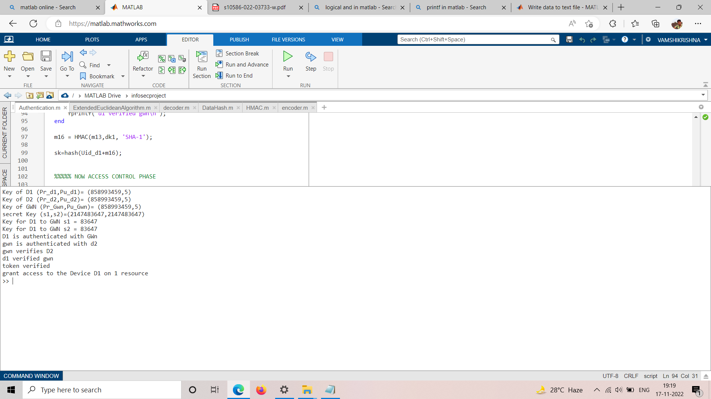

# ISUACC-IoT
Secure unified authentication and access control system based on capability for IoT

### The code is written in matlab 

##  To Run 

Clone the project

```bash
  git clone https://github.com/vamshikrishnam-coder/ISUACC-IoT
```

Go to the project directory

```bash
  cd ISUACC-IoT
```


## Files

#### [Authentication and access control file to be executed](Authentication_and_AccessControl.m)
- it is the main file to be executed
#### [ExtendedEuclideanAlgorithm](ExtendedEuclideanAlgorithm.m)
- ExtendedEuclideanAlgorithm
#### [GenerateKeyPair.m](GenerateKeyPair.m)
- this will generate the public and private key pairs 
#### [HMAC](HMAC.m)  and [DataHash](DataHash.m)
- It is the Message authentication code function and DataHash is its helper function
#### [Hash](hash.m)
- it is the simple hash function 
#### [encryption](encoder.m) and [decryption](decoder.m)
- they are data encryption and decryption functions 
- it it is a symentric key encryption and decryption

## Demo



## flow Charts

####Authentication  phase-1 


- Aunthentication phase-2 


- Access control 


